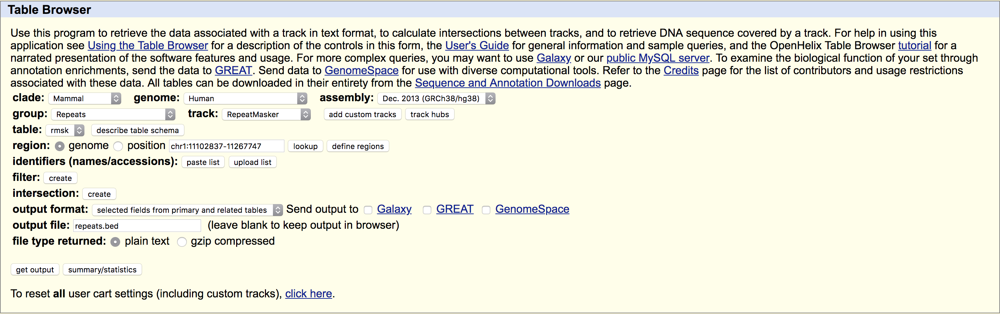
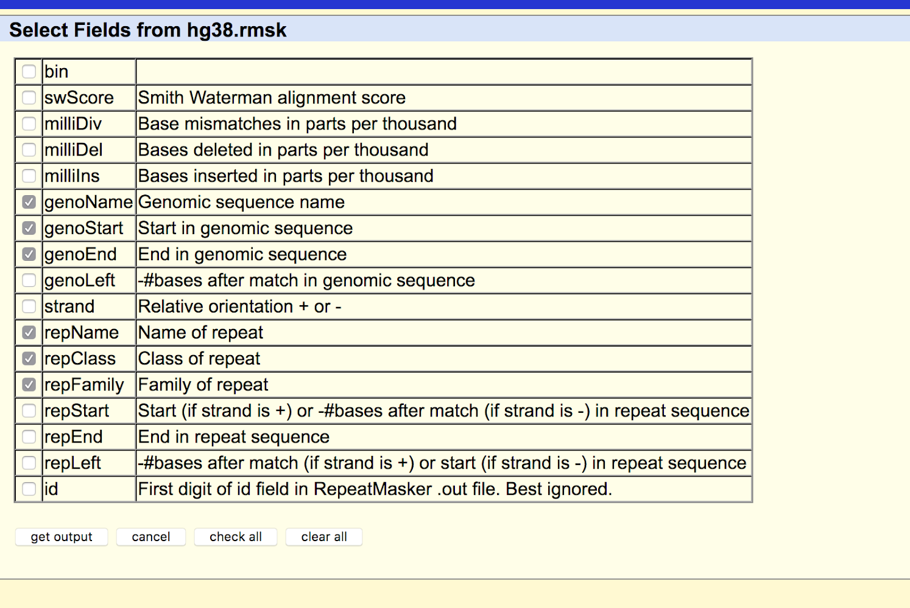

===========
Sorting Hat
===========

Sorts indels into classes defined as follows:
  - **homopolymer run (HR):** mutation is in a region where there are 6 or more
    copies of the nucleotide being inserted or deleted
  - **change in copy count (CCC):** the allele being inserted or deleted has 1 or
    more repeats in the mutation region
  - **no change in copy count (non-CCC):** the allele being inserted or deleted is
    not repeated in the mutation region

In order to use sorting_hat, you must ensure the following are installed:
  - `Python >=3.5.0`_
  - `bedtools >=2.27.0`_

To install, use *pip*:

.. code-block::

    pip install sorting_hat

Example run

.. code-block:: bash

    sorting_hat --bed test.bed \
                --fasta test.fasta \
                --repeat repeat_masker.txt

Usage

.. code-block::

    sorting_hat [-h] -b BED -f FASTA -r REPEAT [-o OUTPUT]

Sorts indels into mutational classes

  -b BED, --bed BED     Location of BED file with all variants. Must be
                        formatted as Chrom/Start/End/Ref/Alt/PatientID.
  -f FASTA, --fasta FASTA
                        Location of reference fasta file.
  -r REPEAT, --repeat REPEAT
                        Location of RepeatMasker file downloaded from UCSC
                        Genome Browser. Refer to docs to see how to download
                        RepeatMasker.
  -o OUTPUT, --output OUTPUT
                        Name of output file, if not chosen then will print to
                        stdout.

To download RepeatMasker from UCSC Genome Browser:

Allison Seiden <ahseiden@gmail.com>

.. _Python >=3.5.0: https://www.python.org/downloads/release/python-350/
.. _bedtools >=2.27.0: http://bedtools.readthedocs.io/en/latest/
